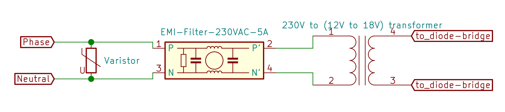

# PedalBoard-Alimentation
***
1. [230V Schematic](#230V Schematic)
2. [10 Ouputs (7x9V +3x9-12V) Schematic and PCB](#10 Ouputs Schematic) 
3. [7 Outpout (7x9v) Schematic and PCB](#7 Output Schematic and PCB)
4. [Only One ouput Schematic](#Schematic of one output)
5. [Kicad sources files](#Kicad sources files)
***
## 230V Schematic

